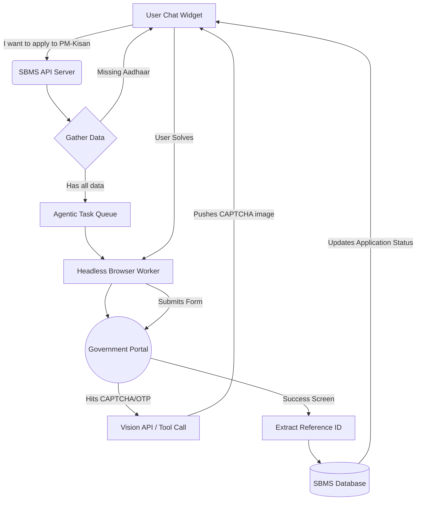

# Building the SBMS Browser Agent (Action Agent)
# A Complete Architecture & Implementation Guide

---

## 🧭 Concept Overview
An **Action Agent** (or Browser Agent) is a specific type of AI architecture designed not just to answer text questions, but to take *real-world actions* on behalf of the user. For the Smart Beneficiary Mapping System (SBMS), this means an AI that takes the user's details and silently fills out government scholarship/welfare forms (like the National Scholarship Portal, PM-Kisan) in the background.

This document outlines exactly how to build a **"Human-in-the-Loop Browser Co-Pilot"** to overcome the extreme challenges of Indian Government Portals (CAPTCHAs & OTPs).

---

## 🏗️ The System Architecture

To build this, you must separate your normal Chat LLM (Groq) from your "Action" pipeline.



---

## 🛠️ Required Technologies

You need a completely different stack specifically for the **Worker Node** (the piece that browses the web).

1. **Browser Automation:** `Playwright` (Puppeteer is okay, but Playwright is faster and more resilient).
2. **Vision LLM:** `GPT-4o` or `Gemini 1.5 Pro`. Standard Groq LLaMA models cannot "see" the screen. The AI must visually look at the form to know what to fill.
3. **Agent Framework:** `browser-use` (Python) or `Langchain JS` + `Playwright`.
4. **Queue System:** Upstash Redis or BullMQ. (Browser tasks take 30-90 seconds. Vercel Serverless functions timeout after 10s. You *must* run this carefully or outside standard Vercel bounds).

---

## 🚀 Step-by-Step Implementation Guide

### Phase 1: Creating the Web Worker (Playwright)

First, you need to spin out a background worker capable of opening a hidden browser.

1. **Install Playwright & Agent Tools**
   ```bash
   npm install playwright @langchain/core @langchain/openai
   ```

2. **Establish the Worker File**
   Create a separate worker script (`src/lib/agent/browserWorker.ts`) that initializes Playwright context, opens the target scheme URL, and waits for instructions.

### Phase 2: Building the "Read & Act" Loop

The core principle of a Browser Agent is the **Observe → Plan → Act** loop.

1. **Take a Screenshot:** The headless browser takes a screenshot of the current login page of NSP.
2. **Send to Vision API:** Send the screenshot and the user's profile JSON to Gemini 1.5 Pro.
   *Prompt:* `"You are a browser agent. Given this screenshot of a government form and the user's profile {name: 'Karan', aadhaar: '1234'}, determine the exact CSS selector of the input field you need to click and what to type."`
3. **Execute Action:** Gemini replies in JSON format: `{"action": "type", "selector": "#txtAadhaarNo", "value": "1234"}`.
4. **Playwright types the value.**
5. **Loop:** Take another screenshot. Repeat until the form is filled.

### Phase 3: Solving the "Human-in-the-Loop" Problem (CAPTCHA & OTP)

Government portals block bots. You cannot use 2Captcha (illegal/unreliable for government sites). You must ask the user *in real-time* while the headless browser sits open.

1. **Detecting the Blocker:** When the Vision AI sees a CAPTCHA box or an "Enter OTP sent to your mobile" screen, the AI returns a special action: `{"action": "request_human", "reason": "CAPTCHA", "image_base64": "..."}`.
2. **Pause the Browser:** Playwright pauses execution. It keeps the session and cookies alive.
3. **Alert the Chat:** The NodeJS server sends a WebSocket message (or Server-Sent Event) to your Next.js Chat Widget. 
   - The Assistant says: *"I've filled out 80% of the form! However, the portal requires you to solve this CAPTCHA. Please type the letters below."*
   - It renders an `` of the CAPTCHA in the chat.
4. **Resume browser:** The user types the CAPTCHA into the chat. The string is sent back to the Playwright worker. Playwright clicks the CAPTCHA box, types the text, and clicks Submit.

### Phase 4: Scraping the Result (Closing the Loop)

1. Once the form submits, the Vision AI looks at the success screen.
2. Instruct the AI: *"Find the Application Reference Number on this page. Extract it."*
3. The AI returns `{"action": "success", "reference_id": "NSP-2026-98765"}`.
4. **Database Write:** Your backend updates `externalApplicationId` in the Prisma `Application` model.
5. **Success Message:** The Chatbot tells the user: *"Done! Application NSP-2026-98765 submitted. I will monitor the status automatically."*

---

## ⚠️ Massive Challenges & Solutions

| Challenge | Impact | Technical Solution |
| :--- | :--- | :--- |
| **Vercel Timeout Limits** | Next.js API routes timeout after 10s (60s on Pro). A browser agent takes minutes. | Do not run this inside a standard `/api/` route. Deploy a separate NodeJS worker on Railway, Render, or an AWS EC2 instance that strictly listens to Redis queues. |
| **IP Blocking / Cloudflare** | Government portals block AWS/Cloud IPs instantly. | You must route Playwright traffic through Residential Proxies (e.g., BrightData or Oxylabs) located in India. |
| **Session Expiry** | While waiting for the user to type the OTP, the government session might timeout. | Implement a fast polling mechanism. Warn the user: *"You have 60 seconds to enter the OTP."* |
| **Dynamic DOM Modifications** | Government sites use messy, changing `<input>` IDs. Standard scraping breaks. | Do not rely on hardcoded `document.querySelector('#aadhaar')`. Rely *only* on the Vision Model interpreting the screenshot coordinates to build robust, self-healing automation. |

---

## 📝 Code Example: The Browser Agent Loop 
*(A simplified conceptual snippet for your worker)*

```typescript
// src/lib/agent/runner.ts
import { chromium } from 'playwright';
import { askVisionModel } from './ai'; 

export async function runFormFillingAgent(targetUrl: string, userProfile: any, chatCallback: Function) {
    const browser = await chromium.launch({ headless: true });
    const page = await browser.newPage();
    await page.goto(targetUrl);

    let isFinished = false;

    while (!isFinished) {
        const screenshot = await page.screenshot({ encoding: "base64" });
        
        // Ask Gemini what to do next based on the screen
        const instruction = await askVisionModel(screenshot, userProfile);

        if (instruction.action === "type") {
            await page.fill(instruction.selector, instruction.value);
            
        } else if (instruction.action === "request_human_captcha") {
            // Pause browser, ask the chat UI via callback
            const captchaElement = await page.$(instruction.selector);
            const captchaImg = await captchaElement.screenshot({ encoding: "base64" });
            
            const humanAnswer = await chatCallback("solve_captcha", captchaImg);
            await page.fill(instruction.inputSelector, humanAnswer);
            await page.click(instruction.submitSelector);
            
        } else if (instruction.action === "success") {
            isFinished = true;
            return instruction.reference_id; // "NSP-1234"
        }
    }
    
    await browser.close();
}
```

## Bottom Line
Building a fully automated agent for government sites is an enterprise-level engineering challenge. The key to making it reliable is **shifting from simple text scraping (which breaks) to Vision-based planning (which understands visually like a human)** intertwined with a **fast interactive chat loop** to bypass CAPTCHAs.
