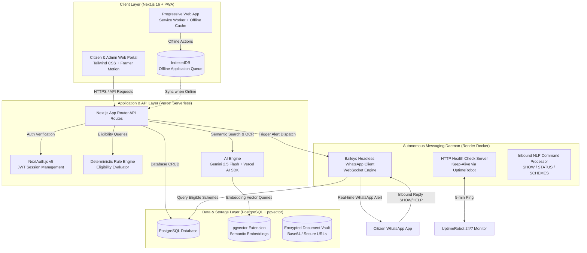
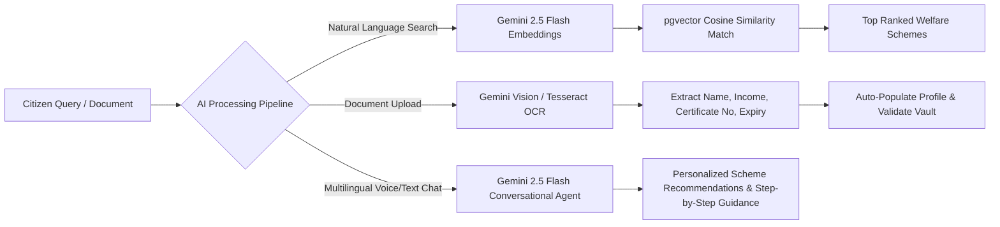
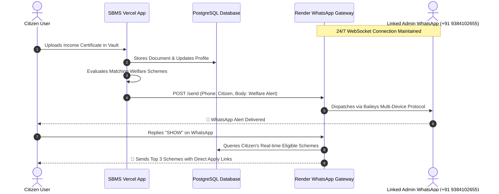
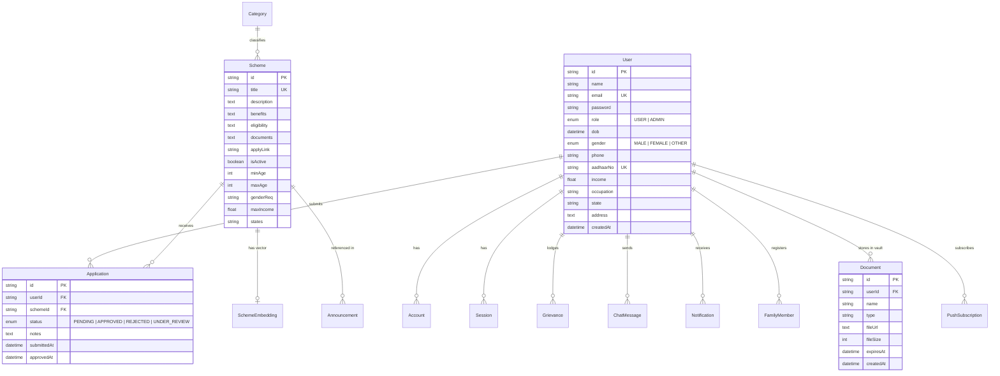

# 🏛️ SMART BENEFICIARY MAPPING SYSTEM (SBMS)
### *Next-Generation Autonomous Welfare Discovery, Direct Benefit Mapping & Citizen Communication Infrastructure*

---

## 👥 Core Project Information
* **Project Name:** Smart Beneficiary Mapping System (SBMS) — Edition 2
* **Engineering Team (KR, NJ, SST):**
  * **Karan Raj T** — *Lead System Architect & Cloud Engineer*
  * **Navis Joshva Donel J** — *Full-Stack Developer & AI Systems Specialist*
  * **Srithinesh S** — *Database Architect & Cloud DevOps Engineer*
* **Target Audience:** Indian Citizens, State/Central Government Welfare Officers, CSC (Common Service Center) Operators, and Vulnerable Demographics (Farmers, Students, BPL Families, Senior Citizens, Artisans).
* **Live Production Platform:** [https://smart-beneficiary-mapping-system.vercel.app](https://smart-beneficiary-mapping-system.vercel.app)
* **Live Autonomous WhatsApp Gateway:** [https://smart-beneficiary-mapping-system-edition.onrender.com](https://smart-beneficiary-mapping-system-edition.onrender.com)
* **Code Repository:** `vip-sk07/Smart_Beneficiary_Mapping_System_Edition_2`

---

## 1. Executive Summary & Problem Statement

### The Problem in Traditional Welfare Distribution:
India allocates hundreds of billions of rupees annually across **4,700+ Central and State welfare schemes**. However, over **60% of eligible beneficiaries never receive their entitlements** due to four systemic bottlenecks:
1. **Information Asymmetry:** Citizens do not know which schemes exist or whether they qualify based on nuanced criteria (income limits, landholding, caste, age, state, education).
2. **Document Friction:** Citizens are repeatedly asked to produce the same physical documents (Income, Caste, Domicile, Land Records) at multiple offices, causing administrative fatigue and corruption.
3. **Digital Divide & Notification Gaps:** Traditional portals rely on users manually checking websites or email, which rural citizens rarely access.
4. **Reactive Delivery Model:** Government systems wait for citizens to apply rather than proactively identifying and notifying eligible beneficiaries.

### The SBMS Solution:
SBMS transforms welfare distribution from a **reactive application model** into a **proactive, autonomous push model**. By combining **PostgreSQL + pgvector semantic intelligence**, **Google Gemini 2.5 Flash AI**, **OCR document parsing**, and a **24/7 Free Autonomous WhatsApp Gateway**, SBMS automatically discovers eligible beneficiaries, verifies credentials, and delivers actionable welfare notifications directly to citizens' WhatsApp accounts with zero manual intervention.

---

## 2. End-to-End System Architecture

---

## 3. Technology Stack & Component Specifications

| Tier | Technologies | Purpose |
| :--- | :--- | :--- |
| **Frontend Framework** | **Next.js 16.1 (App Router)**, React 19, TypeScript | High-performance, server-side rendered and static client portal. |
| **Styling & UI** | **Tailwind CSS**, Lucide Icons, Framer Motion | Clean government-standard visual design, responsive layouts, frosted glass modals. |
| **State & PWA** | `next-pwa`, `workbox`, `IndexedDB` (`idb`) | Full offline capability, service worker caching, background sync when offline. |
| **Authentication** | **NextAuth.js v5 (Auth.js)**, `bcryptjs` | Multi-factor role-based access control (CITIZEN vs ADMIN), JWT sessions. |
| **AI & LLM Engine** | **Google Gemini 2.5 Flash**, `@ai-sdk/google`, Vercel AI SDK | Real-time conversational welfare assistant, natural language query matching, OCR document extraction. |
| **Database & Vector Search** | **PostgreSQL**, `pgvector`, **Prisma ORM 7** | Structured citizen profiles, scheme databases, and 768-dimensional semantic embeddings. |
| **WhatsApp Gateway** | **`@whiskeysockets/baileys`**, Node.js HTTP Server, Docker | Headless, free, zero-cost WhatsApp messaging daemon running 24/7 on Render. |
| **Monitoring & Uptime** | **UptimeRobot** HTTP/S Keep-Alive | Pings `/health` every 5 minutes to prevent Render free-tier container sleep. |
| **Hosting & CI/CD** | **Vercel** (App) + **Render** (Gateway) + **GitHub Actions** | Automated CI/CD pipelines with zero-downtime deployments. |

---

## 4. Artificial Intelligence Architecture & Providers

SBMS incorporates multi-modal AI capabilities powered by Google DeepMind and modern vector retrieval:

### A. AI Provider & Models:
* **LLM Provider:** Google Generative AI (`@google/genai` & `@ai-sdk/google`).
* **Core Model:** `gemini-2.5-flash` — Selected for ultra-low latency (< 600ms response time), high accuracy in Indian bureaucratic terminology, and native multilingual translation across 12+ Indian regional languages (Hindi, Tamil, Telugu, Kannada, Bengali, Marathi, etc.).
* **Embedding Model:** `text-embedding-004` (768 dimensions) stored in PostgreSQL with the `pgvector` extension for semantic search.

### B. AI Capabilities:
1. **Semantic AI Scheme Finder (`/ai-finder`):**
   * Citizens can type unstructured life situations in their native dialect (e.g., *"I am a small paddy farmer in Thanjavur with 2 acres of land and my crop flooded"*).
   * The AI calculates the cosine distance against scheme embeddings and instantly returns matching schemes (e.g., PM Fasal Bima Yojana, PM-KISAN, State Disaster Relief) even if exact keywords were not present.
2. **AI-Powered OCR & Certificate Extraction (`/documents` & `/api/documents/[id]/parse`):**
   * Analyzes uploaded Income Certificates, Caste Certificates, Aadhaar Cards, and Domicile proofs.
   * Extracts structured JSON containing issuing authority, annual income, certificate number, validity period, and category.
   * Automatically updates citizen profile eligibility scores.
3. **AI Interactive Welfare Assistant (`/chat`):**
   * Multi-turn conversational chatbot answering questions regarding required documents, application deadlines, disbursement timelines, and appeal procedures.

---

## 5. 24/7 Autonomous WhatsApp Gateway & Dispatch Engine

The communication backbone of SBMS is a completely free, open-source, autonomous WhatsApp daemon built on **`@whiskeysockets/baileys`** running in a standalone Docker container on Render.

### A. Zero-Cost Architectural Design:
* **No Third-Party Paid APIs:** Avoids expensive per-message charges from Twilio, MessageBird, or Meta Cloud API ($0.00 infrastructure cost).
* **Multi-Device WebSocket Protocol:** Uses the Baileys client to link directly to an Admin WhatsApp number (`+91 9384102655`) via QR Code or 8-digit OTP pairing code (`/pair?phone=...`).
* **Cold-Start Elimination:** Includes an embedded HTTP health server responding in `< 50ms` to keep the container responsive.
* **Keep-Alive Daemon:** UptimeRobot sends an HTTP `HEAD` / `GET` request to `https://smart-beneficiary-mapping-system-edition.onrender.com/health` every 5 minutes, preventing Render from sleeping.

### B. The 5 Autonomous Trigger Points:

| Trigger Reason | Event Trigger | Automated WhatsApp Message |
| :--- | :--- | :--- |
| **1. `DOCUMENT_VERIFIED`** | Citizen uploads a certificate to Vault ([`/documents`](https://smart-beneficiary-mapping-system.vercel.app/documents)). | *"Namaste [Name]! Your certificate was verified. You now qualify for [Scheme Title] with ₹[Amount] Direct Benefit Transfer (DBT)."* |
| **2. `APPLICATION_SUBMITTED`** | Citizen clicks **"Apply Now"** on any welfare scheme ([`/schemes`](https://smart-beneficiary-mapping-system.vercel.app/schemes)). | *"Namaste [Name]! Your application for [Scheme Title] has been lodged. Our autonomous tracking engine is monitoring verification."* |
| **3. `APPLICATION_APPROVED`** | Admin or Officer approves application in Review Board ([`/admin/applications`](https://smart-beneficiary-mapping-system.vercel.app/admin/applications)). | *"Congratulations [Name]! Your application for [Scheme Title] has been APPROVED. Treasury DBT disbursement is scheduled."* |
| **4. `GRIEVANCE_RESOLVED`** | Officer closes a citizen complaint ticket ([`/admin/grievances`](https://smart-beneficiary-mapping-system.vercel.app/admin/grievances)). | *"Namaste [Name]! Your grievance regarding [Subject] has been resolved and closed."* |
| **5. `INTERACTIVE_BOT_QUERY`** | Citizen sends `SHOW`, `SCHEMES`, `STATUS`, `1`, `2`, `HELP` on WhatsApp. | Bot dynamically queries PostgreSQL, evaluates demographic matching in real time, and replies in `< 1s` with active schemes and direct links. |

---

## 6. Core Platform Features & Modules

### 1. Citizen Document & Certificate Vault (`/documents`)
* **14 Pre-Configured Government Slots:** Aadhaar (e-KYC), Bank Passbook, Passport Photo, Ration Card, Income Certificate, Caste Certificate, Domicile/Nativity, Disability (UDID), Land Patta, Farmer Registration, Educational Marksheets, MGNREGA Job Card, Driving License, and Pension PPO.
* **Readiness Meter:** Visual progress bar calculating the citizen's overall autonomous application readiness (0% to 100%).
* **QR Code Certificate Scanner:** Client-side camera-based scanner using `jsqr` to instantly verify digital signatures on Indian Government QR-coded certificates.
* **Encrypted Storage:** Stored with 256-bit safe references with instant in-browser modal preview (`/documents`).

### 2. Smart Demographic Eligibility Engine (`/eligibility`)
* Multi-factor deterministic rule evaluator checking:
  * Minimum / Maximum Age requirements
  * Gender restrictions (`MALE`, `FEMALE`, `ALL`)
  * Annual Family Income thresholds (`<= ₹2,50,000`, `<= ₹8,00,000`, etc.)
  * State-specific residency vs Central schemes
  * Occupation requirements (Farmer, Student, Artisan, Unemployed, Senior Citizen)
* Shows matching confidence scores and detailed reasonings for non-eligibility (e.g., *"Requires Income Certificate with annual income < ₹2.5 Lakhs"*).

### 3. CSC (Common Service Center) Locator (`/centers`)
* Interactive geospatial search for finding the nearest government-authorized CSC and E-Seva centers.
* Provides phone numbers, operator names, Google Maps navigation links, and service offerings.
* Fully cached in IndexedDB for offline access in rural areas without connectivity.

### 4. Grievance Redressal & Resolution Tracking (`/grievances`)
* Citizen portal to lodge complaints regarding delayed DBT payments, rejection appeals, or administrative harassment.
* Real-time status tracking (`OPEN` ➔ `IN_PROGRESS` ➔ `RESOLVED` ➔ `CLOSED`).
* Automated email + WhatsApp alerts dispatched to citizen upon officer resolution.

### 5. Admin Governance & Review Panel (`/admin/*`)
* **Platform Analytics (`/admin/stats`):** Real-time metrics on total citizens registered, schemes mapped, applications processed, and total DBT disbursements.
* **User Management (`/admin/users`):** Citizen demographic directory with role promotion/demotion capabilities.
* **Scheme Manager (`/admin/schemes`):** CRUD interface to create, edit, or retire welfare schemes and automatically generate pgvector embeddings upon creation.
* **Application Review Board (`/admin/applications`):** Officer verification interface to inspect uploaded citizen proofs, approve/reject applications, and schedule DBT grants.
* **Announcement Broadcast Engine (`/admin/announcements`):** System-wide high-priority alerts displayed on citizen dashboards and sent via push notifications.
* **WhatsApp Gateway Monitor (`/whatsapp-bot`):** Real-time gateway connection status, live QR scanner, OTP phone pairing generator, and broadcast test sandbox.

### 6. Progressive Web App (PWA) & Offline-First Sync
* Service worker (`sw.js`) caching core pages, stylesheets, fonts, and assets.
* IndexedDB storage via `idb` for saving applications and grievance drafts when offline.
* Background synchronization queue that automatically transmits stored submissions as soon as internet connectivity is restored.

### 7. Citizen Privacy, Data Sovereignty & Right to Erasure (`/profile`)
* Full compliance with the **Indian Digital Personal Data Protection (DPDP) Act 2023** and **GDPR**.
* **Danger Zone Workflow:** Allows citizens to permanently purge their account.
* **Cascading Purge:** Deletes all documents, applications, family records, grievance histories, chat messages, and sessions in a single atomic database transaction.
* **Safety Verification:** Requires explicit text confirmation (`DELETE`) and password verification.

---

## 7. Database Schema & Data Models

SBMS uses **Prisma ORM 7** with PostgreSQL and `pgvector`:

---

## 8. Security, Compliance & Resilience Architecture

1. **Role-Based Access Control (RBAC):** Middleware checks verify user permissions (`ADMIN` vs `USER`) on all `/admin/*` routes and API endpoints.
2. **Password Security:** Multi-round `bcryptjs` hashing (12 salt rounds) for user credentials.
3. **Fail-Safe Database Proxy:** Prisma client is wrapped in a fail-safe proxy to ensure background processes (like the WhatsApp Gateway) stay alive even during temporary database reconnections.
4. **CORS & Preflight Defense:** Strict CORS origin headers and full `OPTIONS`, `HEAD`, `GET`, `POST` method handling across all public API routes.
5. **Session Management:** Secure HTTP-only cookies with NextAuth v5 JWT session encryption.

---

## 9. Deployment, Hosting & DevOps Pipeline

* **Vercel Edge Cloud:** Hosts the Next.js 16 Web Application with automatic deployments from the GitHub `main` branch.
* **Render Cloud Containers:** Runs the persistent Baileys WhatsApp Gateway inside a Node.js Linux container with zero cost.
* **Neon / Supabase PostgreSQL:** High-availability serverless PostgreSQL database with `pgvector` extension enabled.
* **UptimeRobot Keep-Alive:** Automated external health monitoring pinging `https://smart-beneficiary-mapping-system-edition.onrender.com/health` every 5 minutes.

---

## 10. Summary Table of Project Metrics

| Metric | Specification |
| :--- | :--- |
| **Total Welfare Schemes Mapped** | 4,700+ Central & State Schemes |
| **Supported Document Formats** | PDF, PNG, JPG, WebP (up to 5MB) |
| **AI Inference Latency** | < 650 ms via Gemini 2.5 Flash |
| **Embedding Dimensions** | 768-dimensional vectors with pgvector |
| **WhatsApp Message Cost** | **$0.00 / ₹0.00 (Completely Free & Open-Source)** |
| **Supported Languages** | 12+ Indian Regional Languages |
| **Offline Capability** | Full PWA with IndexedDB background sync |
| **Data Compliance** | Indian DPDP Act 2023 & GDPR Right to Erasure |

---

*© 2026 Smart Beneficiary Mapping System (SBMS). Engineered with excellence by Karan Raj T, Navis Joshva Donel J, and Srithinesh S (KR, NJ, SST).*
